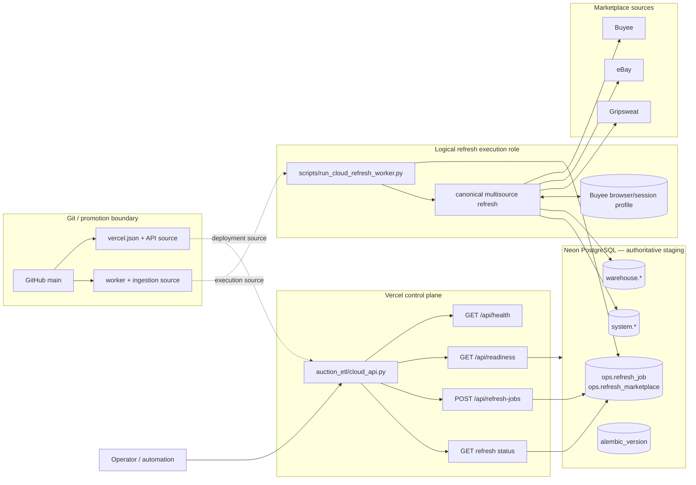
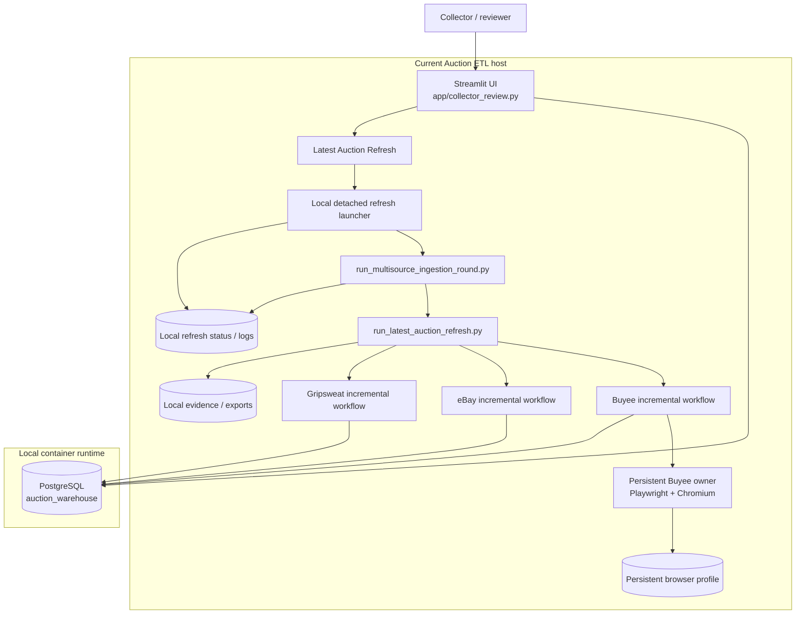
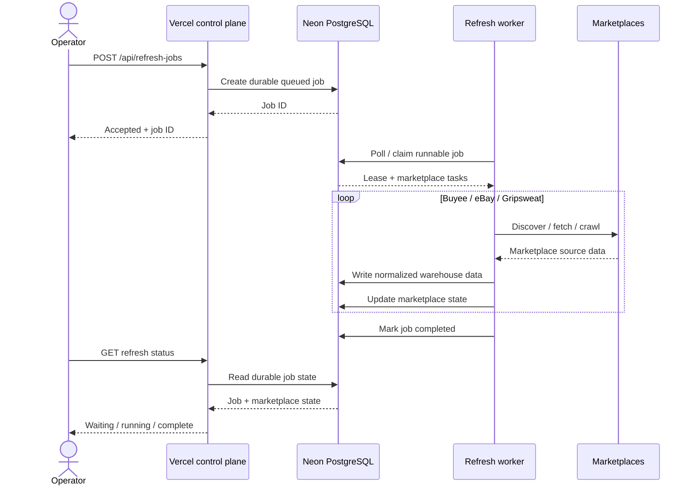

# Collector Ledger Architecture

> **Architecture status:** Vercel + Neon staging acceptance closed on 2026-08-19; the accepted Phase-C source has since been merged into `main`.
>
> **Product/documentation name:** Collector Ledger.
>
> **Compatibility names remain unchanged for now:** `auction_etl`, `~/auction-etl`, and the Vercel project `auction-etl-staging`.
>
> **Important distinction:** the worker is a required logical execution role, but no persistent cloud worker host is currently part of the accepted Vercel + Neon staging milestone.

## 1. System purpose

Collector Ledger collects, normalizes, reviews, and enriches marketplace auction records while preserving evidence, provenance, deterministic identity, and auditable user decisions.

The system separates four responsibilities:

1. **Control plane** — receives refresh commands and reports durable job state.
2. **Data plane** — stores canonical auction data and durable coordination state.
3. **Execution plane** — performs marketplace crawling, browser automation, parsing, normalization, and warehouse writes.
4. **Source/promotion boundary** — Git history and explicit promotion determine which source is staging or production.

Browser automation and marketplace crawling have a different lifecycle from HTTP requests and must not depend on one Vercel request or one Vercel process remaining alive.

## 2. Architecture at a glance

The Phase-C durable-refresh source has now been merged into `main`. The diagrams below distinguish the accepted staging runtime topology from the broader repository architecture.

### 2.1 Accepted staging runtime topology



The source relationship shown above does not imply that every `main` commit automatically redeploys every runtime. Source promotion, Vercel deployment, database promotion, and worker deployment remain separately controlled operations.

### 2.2 Whole-repository functional map

```mermaid
flowchart TB
    Collector["Collector / reviewer"]

    subgraph UI["Application UI — app/"]
        Review["collector_review.py"]
        Navigation["navigation.py"]
        Analytics["collector_analytics_editor.py"]
        ExportUI["collector_export.py"]
        Workbenches["app/pages/*<br/>intake / completeness / pressing / evidence / analytics"]
    end

    subgraph Package["Core package — auction_etl/"]
        Services["auction_etl/services/*<br/>application workflows"]
        Domain["domain/*<br/>pressing/reference domain"]
        Classifiers["classifiers/*"]
        Crawlers["crawlers/*"]
        Discovery["discovery/*"]
        Parsers["parser + parsers/*"]
        Reporting["reporting/*"]
        Database["database + models"]
        Browser["browser + auth"]
    end

    subgraph CloudControl["Cloud control plane"]
        CloudAPI["cloud_api.py"]
        Vercel["Vercel"]
    end

    subgraph Refresh["Refresh orchestration — scripts/"]
        Worker["run_cloud_refresh_worker.py"]
        Multi["run_multisource_ingestion_round.py"]
        Latest["run_latest_auction_refresh.py"]
        Sync["sync_warehouse_incremental.py"]
        BuyeeOwner["Buyee Playwright owner"]
    end

    subgraph Sources["External marketplace sources"]
        Buyee["Buyee"]
        Ebay["eBay"]
        Gripsweat["Gripsweat"]
    end

    subgraph PostgreSQL["PostgreSQL state"]
        Neon[("Neon staging")]
        Local[("Local PostgreSQL")]
        Ops["ops.* durable coordination"]
        Warehouse["warehouse.* canonical records"]
        System["system.* operational state"]
    end

    subgraph Schema["Schema evolution"]
        Alembic["alembic/versions/*"]
    end

    subgraph Outputs["Collector outputs"]
        Evidence["Evidence / audit artifacts"]
        Exports["CSV / Excel / JSON / Markdown / Word"]
    end

    Collector --> Review
    Review --> Navigation
    Navigation --> Workbenches
    Review --> Analytics
    Review --> ExportUI

    Review --> Services
    Workbenches --> Services
    Analytics --> Services
    ExportUI --> Reporting

    Services --> Domain
    Services --> Classifiers
    Services --> Database
    Services --> Reporting

    Crawlers --> Parsers
    Discovery --> Crawlers
    Browser --> Crawlers

    Vercel --> CloudAPI
    Collector --> Vercel
    CloudAPI --> Ops

    Worker --> Ops
    Worker --> Multi
    Multi --> Latest
    Latest --> Discovery
    Latest --> Crawlers
    Latest --> Parsers
    Latest --> Sync
    Latest <--> BuyeeOwner

    Crawlers --> Buyee
    Crawlers --> Ebay
    Discovery --> Ebay
    Multi --> Gripsweat

    Database --> Neon
    Database --> Local

    Neon --- Ops
    Neon --- Warehouse
    Neon --- System

    Sync --> Warehouse
    Services --> Warehouse
    Services --> System

    Alembic --> Neon
    Alembic --> Local

    Reporting --> Exports
    Services --> Evidence
```



This repository therefore contains more than the cloud refresh path. It also contains the collector-facing review product, curation/reference workflows, normalization and classification rules, evidence handling, reporting/export logic, local development infrastructure, database migrations, browser/session management, and extensive acceptance/unit/integration tests.

## 3. Deployment-state matrix

| Component | Architectural role | Current accepted state |
| --- | --- | --- |
| Vercel | HTTP control plane | **Accepted / deployed** |
| Neon PostgreSQL | Authoritative staging data + durable coordination | **Accepted / deployed** |
| Refresh worker | Long-running marketplace execution | **Required logical role; persistent cloud host deferred** |
| Buyee profile storage | Persistent browser/session state for worker | **Required by worker; permanent cloud storage deferred** |
| Local PostgreSQL | Development / comparison / acceptance baseline | **Local only** |
| Railway | Investigated worker-host option | **Deferred; not part of accepted milestone** |
| Git/GitHub | Source history and promotion boundary | **Authoritative source boundary** |

## 4. Known-good production baseline

The validated production baseline is:

- commit `9adf009c698d7448a58d280186fc1f3cd16e9644`;
- tag `production-incremental-20260818-9adf009`;
- Buyee detail enrichment restricted to newly discovered identities;
- eBay newest-first discovery with bounded known-ID overlap;
- Gripsweat detail enrichment restricted to new identities;
- no-prune warehouse synchronization;
- one reusable persistent headed/offscreen Buyee Chromium owner.

The cloud architecture must preserve these semantics.

## 5. Current production architecture

This section preserves the previously documented production/runtime baseline. It is distinct from the accepted cloud-staging control/data plane described later.



## 6. Why the current host model does not fit Vercel

The current refresh implementation assumes that UI and ingestion share:

- a process namespace;
- a writable local filesystem;
- refresh log files;
- a browser profile;
- a Unix socket;
- a persistent Chromium process.

Cloud migration replaces those machine-local coordination assumptions with durable PostgreSQL job and progress state.

The cloud migration therefore moves shared coordination into durable PostgreSQL state while leaving browser-heavy execution in a separate worker role.

## 7. Accepted Vercel control plane

### 7.1 Role

Vercel hosts the lightweight ASGI control plane implemented in:

```text
auction_etl/cloud_api.py
```

Vercel owns HTTP request handling and durable job coordination access. It does **not** own long-running browser or marketplace execution.

### 7.2 Source-defined route contract

The accepted Phase-C source defines:

```text
GET  /api/health
GET  /api/readiness
POST /api/refresh-jobs
GET  /api/refresh-jobs/latest
GET  /api/refresh-jobs/{id}
```

The dynamic job-by-ID route is matched by `_JOB_PATH` and dispatched to `_job_by_id`.

### 7.3 Route evidence matrix

| Route | Purpose | Evidence status |
| --- | --- | --- |
| `GET /api/health` | Liveness | Source-defined and live acceptance passed |
| `GET /api/readiness` | Dependency readiness | Source-defined and live acceptance passed |
| `POST /api/refresh-jobs` | Create a durable refresh job | Source-defined; controlled V3 created the accepted durable job |
| `GET /api/refresh-jobs/latest` | Read latest durable refresh state | Source-defined; no additional closeout probe required |
| `GET /api/refresh-jobs/{id}` | Read one durable job by UUID | Source-defined; final historical-job runtime proof remained not proven |

### 7.4 Acceptance nuance: source contract vs live historical GET

The route contract is proven from the accepted source.

However, the final staging closeout explicitly records:

```text
exact_historical_job_get = NOT_PROVEN
further_probe_allowed    = false
```

Therefore this document does **not** claim that the final Vercel deployment successfully returned the historical controlled-V3 job by ID during closeout.

That distinction prevents source-level route proof from being confused with runtime proof for one historical job record.

### 7.5 Vercel responsibilities

The accepted Vercel responsibility is the lightweight HTTP control plane:

- serve health and readiness endpoints;
- create durable refresh-job coordination state;
- read durable refresh-job state;
- use Neon as the durable coordination dependency.

The accepted staging evidence does **not** require Vercel to authenticate users or render an application UI, so this document does not claim those capabilities as part of the current accepted surface.

Vercel must not:

- own the long-running Chromium session;
- own the durable Buyee browser profile;
- perform marketplace crawling;
- depend on cross-machine Unix sockets;
- start Docker or Colima;
- spawn detached ingestion processes;
- treat local files as shared refresh state.

### 7.6 Current Vercel identity

```text
Project: auction-etl-staging
Domain:  auction-etl-staging.vercel.app
Status:  Ready
```

The Vercel dashboard can label the current deployment **Production Deployment** because it is the production environment of that Vercel project.

That Vercel label does not, by itself, promote the application's production Git/data boundary.

## 8. Accepted Neon staging data plane

Neon PostgreSQL is the authoritative managed staging database.

Accepted closeout state:

```text
Alembic head:        f31a9c7d2e04
Auction rows:        1004
Active refresh jobs: 0
```

### 8.1 Durable coordination

```text
ops.refresh_job
ops.refresh_marketplace
```

These records replace machine-local refresh coordination for the cloud architecture.

### 8.2 Canonical warehouse

Examples referenced by acceptance checks include:

```text
warehouse.auction
warehouse.auction_pressing_assignment
```

### 8.3 Operational state

Examples referenced by acceptance checks include:

```text
system.listing_completeness_snapshot
system.listing_completeness_timeline
system.new_auction_assignment_queue
system.auction_pressing_assignment_audit_event
system.current_listing_completeness_alert
```

## 9. Refresh execution worker

### 9.1 Logical entry point

```text
scripts/run_cloud_refresh_worker.py
```

### 9.2 Responsibilities

The worker owns marketplace requests, crawler retries, Playwright and Chromium, persistent Buyee ownership, browser-profile persistence, job leases and heartbeat, marketplace sequencing, ingestion writes, per-marketplace telemetry, and evidence generation.

### 9.3 Hosting status

The worker is an architectural requirement, but its permanent cloud host is **not currently accepted**.

The controlled V3 execution proved the durable coordination model and marketplace execution path, then stopped the local worker.

No Railway worker deployment was accepted as part of the final Vercel + Neon staging closeout.

## 10. Buyee browser/session state

Buyee requires persistent browser/session state separate from PostgreSQL.

The controlled workflow used:

```text
~/auction-etl/profiles/buyee
```

This state belongs to the execution plane.

It is not:

- canonical warehouse data;
- Vercel configuration;
- Git-tracked data.

A future persistent worker host must provide a durable profile-storage contract before that worker can be considered production-ready.

## 11. Incremental marketplace policies

### 11.1 Normal marketplace progression

```text
Buyee      running -> done
eBay       waiting -> running -> done
Gripsweat  waiting -> running -> done
```

A source failure stops the round and leaves later sources waiting.

### 11.2 Buyee

Normal Latest Refresh:

1. reuse or establish the persistent browser owner;
2. verify authenticated closed-watchlist access;
3. discover identities;
4. synchronize identities without pruning;
5. calculate new warehouse IDs;
6. crawl details only for new IDs;
7. skip detail crawling when there are no new IDs.

### 11.3 eBay

Normal Latest Refresh:

1. discover newest listings first;
2. classify identities against the warehouse;
3. retain new identities;
4. count consecutive known identities;
5. stop after the bounded known-overlap threshold;
6. tolerate discovery-page granularity overshoot;
7. avoid historical detail re-scraping.

### 11.4 Gripsweat

Normal Latest Refresh:

1. discover the newest identity surface;
2. compare it with warehouse identities;
3. avoid unnecessary historical pagination;
4. enrich only new identities;
5. skip detail crawling when there are zero new IDs.

## 12. Durable state ownership

| State | Current/accepted authority | Notes |
| --- | --- | --- |
| Canonical auction/domain data | Neon PostgreSQL in staging | Local PostgreSQL is not staging authority |
| Refresh request | `ops.refresh_job` | Durable coordination |
| Marketplace lifecycle | `ops.refresh_marketplace` | Durable per-marketplace progress |
| Operational queue/completeness/audit state | `system.*` | Durable database state |
| Buyee browser owner | Worker execution process | Hosting provider deferred |
| Buyee browser profile | Worker-side durable storage requirement | Permanent cloud storage deferred |
| Evidence / exports | Application evidence paths today | Durable object-storage decision remains separate |
| Secrets | Platform/local secret stores | Never source-controlled |

## 13. Durable refresh lifecycle



## 14. Controlled-V3 accepted state

The exactly-once controlled staging execution is reconciled as:

```text
Classification:
V3_CONTROLLED_STAGING_EXECUTION_PASS_RECONCILED

Job ID:
dbfd9692-62ed-49c1-9311-b7ae1cd59d5e

Final state:
completed

Marketplace tasks:
buyee      done
ebay       done
gripsweat  done

Neon auction rows:
1004

Active refresh jobs:
0
```

The acceptance rule is explicit:

```text
CONTROLLED_V3_RERUN_ALLOWED=false
```

Controlled V3 must not be rerun merely to regenerate evidence.

## 15. Local development boundary

The accepted local PostgreSQL baseline remained:

```text
947 auctions
```

Therefore:

```text
Local PostgreSQL = development / comparison / acceptance support
Neon PostgreSQL  = authoritative managed staging state
```

## 16. Failure isolation

A failed HTTP request must not kill ingestion.

A Vercel redeploy must not kill the marketplace worker.

A worker restart must not lose durable job state.

A browser restart must not create duplicate marketplace identities.

A Buyee failure must become an explicit marketplace failure without corrupting eBay, Gripsweat, or warehouse state.

In addition:

- a Vercel request failure must not imply a worker retry;
- a worker-host failure must not erase durable refresh coordination;
- a browser-profile failure must not redefine canonical database state;
- a staging failure must not move the production Git/data boundary.

## 17. Source and promotion boundary

The controlled staging acceptance was executed from the Phase-C source:

```text
77d2927e3ca7fc3ea884ede5c1af451f0f23b51a
```

During that acceptance, the production baseline remained:

```text
9adf009c698d7448a58d280186fc1f3cd16e9644
```

After the staging architecture and controlled-V3 state were accepted, Phase-C was merged into `main` through pull request #1.

```text
Phase-C merge commit:
a98b82a0e8a1902d59e4f886cc2582adc6544c7d

Collector Ledger architecture commit:
687ae0d15f67b78dd85b6e7cafddcbf466a4b005
```

This changes the repository source-history state: `main` now contains the accepted durable-refresh/control-plane implementation.

It does **not** retroactively change what was true during the controlled staging run, and it does **not** imply an automatic production database/runtime cutover.

The boundaries remain separate:

1. source merged to `main`;
2. Vercel deployment state;
3. Neon staging/production data state;
4. persistent worker deployment state.

Production runtime/data promotion must remain explicit.

## 18. Railway status

Railway was investigated as a possible persistent worker host.

Created during the investigation:

- Railway project;
- staging environment;
- empty worker service;
- worker environment variables.

Not completed or accepted:

```text
Railway deployment executed: false
Railway worker started:      false
Railway volume accepted:     false
Buyee profile upload:        false
```

The final staging closeout records:

```text
required_for_current_milestone = false
further_work_deferred          = true
```

Therefore Railway is **not part of the accepted Vercel + Neon staging runtime architecture**.

Future worker hosting may use Railway or another provider, but that is a separate decision.

## 19. Accepted vs deferred

### Accepted now

- Vercel staging control-plane deployment identity.
- Vercel health.
- Vercel readiness.
- Database readiness.
- Neon staging identity.
- Neon Alembic revision `f31a9c7d2e04`.
- Neon staging baseline `1004`.
- Durable PostgreSQL refresh coordination.
- Controlled-V3 reconciled completion.
- Three marketplace tasks completed.
- Zero active staging refresh jobs.
- Local worker stopped after controlled acceptance.
- Controlled-V3 rerun prohibition.
- Phase-C durable-refresh source merged into `main`.

### Historical acceptance boundary

During the controlled staging acceptance, the production baseline remained at:

```text
9adf009c698d7448a58d280186fc1f3cd16e9644
```

That statement describes the safety boundary of the acceptance run. It does not mean the Git `main` branch must remain permanently pinned there.

### Deferred

- permanent cloud worker hosting;
- permanent Buyee profile storage;
- Railway deployment;
- Railway volume/profile upload;
- production runtime/data cutover;
- infrastructure renaming;
- Python package renaming;
- repository renaming.

Merging the accepted Phase-C source into `main` is a source-control promotion. It does not by itself assert that every production runtime or production database has been cut over.

## 20. Naming

Product/documentation name:

```text
Collector Ledger
```

Recommended future repository slug:

```text
collector-ledger
```

Compatibility identifiers retained for now:

```text
Python package: auction_etl
Local checkout: ~/auction-etl
Vercel project: auction-etl-staging
```

Renaming those identifiers must be a separate migration because scripts, deployment metadata, environment configuration, and URLs may depend on them.

## 21. Architecture rules

1. Neon is authoritative staging data.
2. Vercel is the lightweight control plane.
3. Marketplace execution belongs to a worker, not a Vercel request.
4. The logical worker is required even though its permanent host is deferred.
5. Railway is currently deferred and is not part of the accepted milestone.
6. Buyee profile/session state is execution-plane state.
7. Refresh coordination remains durable in PostgreSQL.
8. Controlled V3 is not rerun for documentation or historical proof.
9. Source-level route proof and runtime historical-job proof are different claims.
10. Production promotion is explicit.
11. Infrastructure renames are separate migrations.

## 22. Short reference

```text
Vercel        = accepted control plane
Neon          = accepted authoritative staging DB + durable coordination
Worker        = required execution role; permanent cloud host deferred
Buyee profile = worker/browser session state; permanent cloud storage deferred
Git/GitHub    = source and promotion boundary
Railway       = deferred hosting experiment, not accepted runtime
```

<!-- COLLECTOR_LEDGER_PHASE_D_AUTH_ACCOUNTS -->
## Phase D — identity, authorization, and account tenancy

Phase D places an authenticated account boundary around the existing
architecture. Canonical marketplace facts remain shared while workspace
visibility, configuration, curation, refresh ownership, and marketplace
connections become account-owned.

Historical Vercel + Neon staging acceptance remains unchanged.

Authoritative design:
`docs/PHASE_D_AUTH_ACCOUNT_ARCHITECTURE.md`.
