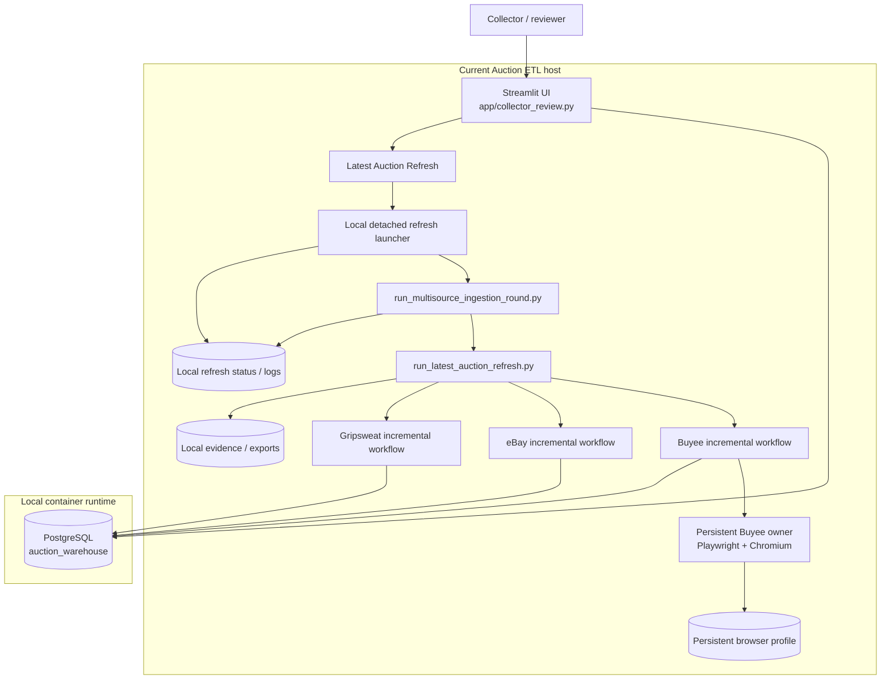
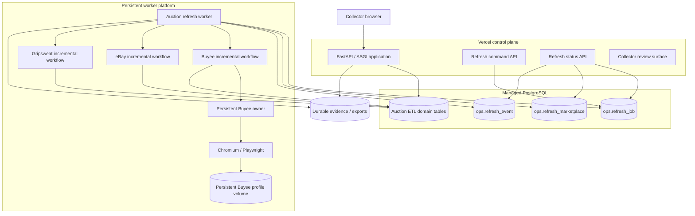
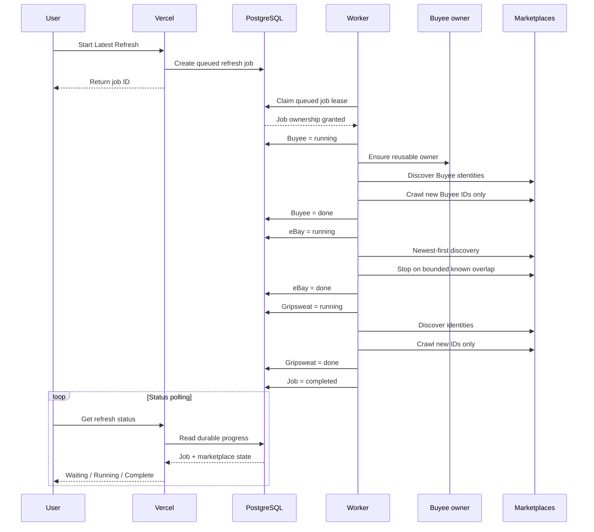

# Auction ETL architecture

## Purpose

Auction ETL collects, normalizes, reviews, and enriches marketplace auction records while preserving evidence, provenance, deterministic identity, and auditable user decisions.

Production intentionally separates three responsibilities:

1. the collector-facing control plane;
2. durable PostgreSQL state;
3. long-running marketplace and browser workers.

Browser automation and marketplace crawling have a different lifecycle from HTTP requests and must not depend on one web request or one web process remaining alive.

## Known-good production baseline

The validated production baseline is:

- commit `9adf009c698d7448a58d280186fc1f3cd16e9644`;
- tag `production-incremental-20260818-9adf009`;
- Buyee detail enrichment restricted to newly discovered identities;
- eBay newest-first discovery with bounded known-ID overlap;
- Gripsweat detail enrichment restricted to new identities;
- no-prune warehouse synchronization;
- one reusable persistent headed/offscreen Buyee Chromium owner.

The cloud architecture must preserve these semantics.

## Current production architecture



## Why the current host model is not the Vercel target

The current refresh implementation assumes that UI and ingestion share:

- a process namespace;
- a writable local filesystem;
- refresh log files;
- a browser profile;
- a Unix socket;
- a persistent Chromium process.

Cloud migration replaces those machine-local coordination assumptions with durable PostgreSQL job and progress state.

## Target cloud architecture

The initial target is:

- Vercel for the HTTP control plane;
- FastAPI/ASGI for the Python API surface;
- managed PostgreSQL as authoritative application and operational state;
- Neon as the initial managed PostgreSQL target;
- Railway as the initial persistent marketplace-worker target;
- a Railway persistent volume for the Buyee browser profile;
- durable object storage for evidence and exports that must survive worker replacement.



## Refresh sequence



## Marketplace progression

The normal user-visible order remains:

```text
Buyee      running -> done
eBay       waiting -> running -> done
Gripsweat  waiting -> running -> done
```

A source failure stops the round and leaves later sources waiting.

## Incremental marketplace policies

### Buyee

Normal Latest Refresh:

1. reuse or establish the persistent browser owner;
2. verify authenticated closed-watchlist access;
3. discover identities;
4. synchronize identities without pruning;
5. calculate new warehouse IDs;
6. crawl details only for new IDs;
7. skip detail crawling when there are no new IDs.

### eBay

Normal Latest Refresh:

1. discover newest listings first;
2. classify identities against the warehouse;
3. retain new identities;
4. count consecutive known identities;
5. stop after the bounded known-overlap threshold;
6. tolerate discovery-page granularity overshoot;
7. avoid historical detail re-scraping.

### Gripsweat

Normal Latest Refresh:

1. discover the newest identity surface;
2. compare it with warehouse identities;
3. avoid unnecessary historical pagination;
4. enrich only new identities;
5. skip detail crawling when there are zero new IDs.

## Durable state ownership

| State | Current | Cloud target |
|---|---|---|
| Domain data | PostgreSQL | Managed PostgreSQL |
| Refresh request | Local process | `ops.refresh_job` |
| Marketplace lifecycle | Local JSON/log state | `ops.refresh_marketplace` |
| Operational events | Log output | `ops.refresh_event` |
| Buyee owner | Local process | Persistent worker |
| Buyee profile | Local directory | Persistent volume |
| Evidence | Local filesystem | Durable object storage |
| Secrets | Ignored local env | Platform secret stores |

## Vercel responsibilities

Vercel may authenticate users, render pages, query application data, perform authorized application writes, enqueue refresh jobs, display durable progress, and expose health/readiness APIs.

Vercel must not own the long-running Chromium session, own the durable Buyee browser profile, depend on cross-machine Unix sockets, start Docker or Colima, spawn detached ingestion processes, or treat local files as shared refresh state.

## Persistent worker responsibilities

The worker owns marketplace requests, crawler retries, Playwright and Chromium, persistent Buyee ownership, browser-profile persistence, job leases and heartbeat, marketplace sequencing, ingestion writes, per-marketplace telemetry, and evidence generation.

## Failure isolation

A failed HTTP request must not kill ingestion.

A Vercel redeploy must not kill the marketplace worker.

A worker restart must not lose durable job state.

A browser restart must not create duplicate marketplace identities.

A Buyee failure must become an explicit marketplace failure without corrupting eBay, Gripsweat, or warehouse state.
