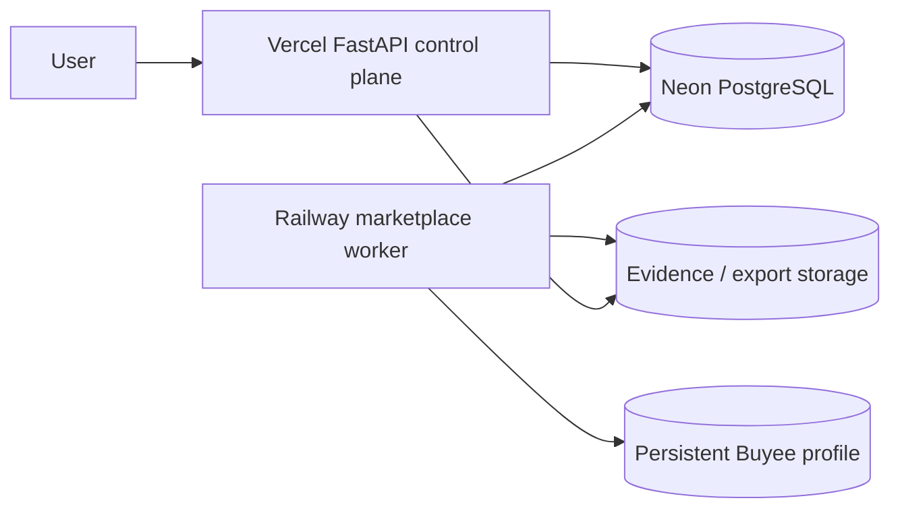
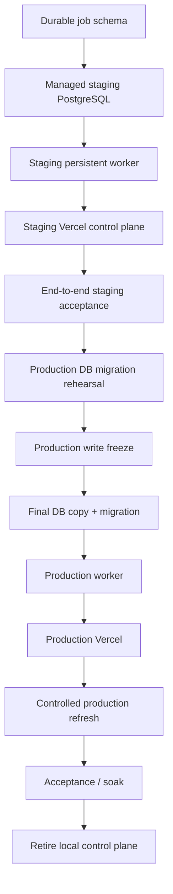

# Auction ETL cloud deployment plan

## Status

Local production is validated.

Cloud production cutover is not yet approved.

The current readiness classifier identifies four implementation blockers:

1. Latest Refresh still launches a machine-local detached process.
2. Refresh status still depends on machine-local filesystem state.
3. The on-demand launcher still contains local Docker/Colima coupling.
4. A Vercel control-plane surface has not yet been implemented.

## Initial target platform

| Responsibility | Target |
|---|---|
| Web/control plane | Vercel |
| Python API | FastAPI / ASGI |
| PostgreSQL | Neon |
| Marketplace worker | Railway |
| Buyee profile | Railway persistent volume |
| Source | GitHub `main` |
| Evidence/exports | Durable object storage |
| Schema migrations | Explicit one-shot deployment command |

Vercel supports FastAPI/ASGI Python applications. The control plane therefore remains Python while long-running browser ownership remains outside the request lifecycle.

## Why ingestion stays outside Vercel request execution

Marketplace refreshes are long-running jobs. Buyee also needs persistent Chromium, a reusable Playwright context, authenticated profile persistence, and process ownership independent of the web server.

Those requirements belong on a persistent worker.

## Cloud topology



## Environment separation

### Vercel

```text
DATABASE_URL=<managed PostgreSQL application URL>
AUCTION_ENV=production
AUCTION_REFRESH_ENABLED=true
AUCTION_REFRESH_SIGNING_SECRET=<secret>
```

### Worker

```text
DATABASE_URL_WORKER=<worker PostgreSQL URL>
AUCTION_ENV=production
AUCTION_WORKER_ID=<stable unique worker ID>
AUCTION_BUYEE_PROFILE_DIR=/data/buyee
AUCTION_BUYEE_OWNER_SOCKET=/tmp/auction-etl/buyee-owner.sock
```

### Migrations

```text
DATABASE_URL_MIGRATIONS=<direct non-pooled PostgreSQL URL>
AUCTION_ENV=production
```

Schema migrations must be explicit deployment operations rather than web request side effects.

## Vercel implementation stages

### Stage 1 — control-plane API

Implement:

```text
GET  /api/health
GET  /api/readiness
POST /api/refresh-jobs
GET  /api/refresh-jobs/{id}
```

Starting a refresh creates a durable job and returns its ID immediately.

### Stage 2 — Latest Refresh UI

Replace:

```text
UI button
  -> local subprocess
  -> local status files
```

with:

```text
UI button
  -> POST refresh job
  -> PostgreSQL queue
  -> persistent worker
  -> PostgreSQL progress
  -> UI polling
```

### Stage 3 — collector/review surfaces

Move remaining user-facing functionality incrementally. The validated local Streamlit application remains available until cloud parity and acceptance are proven.

## Worker migration

Before cloud production:

1. create a platform-neutral worker entrypoint;
2. remove local Docker/Colima startup requirements;
3. read database configuration from environment;
4. claim PostgreSQL refresh jobs;
5. heartbeat active job leases;
6. persist per-marketplace states and counters;
7. mount persistent Buyee profile storage;
8. move durable evidence to object storage;
9. expose worker health/readiness;
10. handle deployment termination cleanly.

Railway supports Playwright Docker deployments and persistent service volumes, making it a viable initial worker host for this architecture.

## Buyee compatibility contract

Production behavior to preserve:

```text
headed Chromium
+ offscreen placement
+ persistent browser context
+ persistent authenticated profile
+ one reusable browser owner
```

Do not silently re-enable true headless mode.

## Deployment environments

Maintain:

```text
local
staging / preview
production
```

Preview deployments must not automatically connect to the production database.

## Deployment order



## Release gates

### Code gate

```text
canonical test suite = pass
deployment readiness = pass
reviewed deployment branch
no production drift
```

### Database gate

```text
backup = pass
staging restore = pass
alembic migration = pass
row-count parity = pass
duplicate identity groups = 0
integrity checks = pass
```

### Worker gate

```text
worker health = pass
persistent profile volume = pass
Buyee verifier = pass
Buyee incremental behavior = pass
eBay incremental behavior = pass
Gripsweat incremental behavior = pass
```

### Vercel gate

```text
health = pass
DB connectivity = pass
enqueue = pass
durable status polling = pass
local subprocess dependency = absent
local refresh-file dependency = absent
```

## No-dual-writer rule

During cutover, the local ingestion runtime and cloud ingestion runtime must never act as simultaneous authoritative writers.

Establish one writer boundary before cloud production is enabled.

## Rollback

Before cloud writes begin, rollback means leaving validated local production authoritative and disabling cloud services.

After cloud writes begin, freeze writes first and determine which database contains authoritative latest state. Do not blindly switch to an older local database.

## Git policy

```text
validated main
  -> deployment branch
  -> tests
  -> staging
  -> acceptance
  -> reviewed merge
  -> production
```

The known-good production tag remains immutable.
