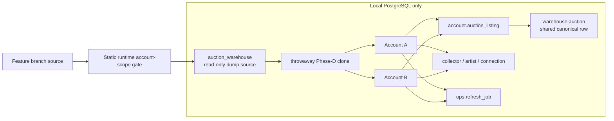

# Phase D2/D3 — Local Isolation Acceptance

## Purpose

This gate proves the schema and critical runtime contract before any managed
database mutation.

## Test topology



## A/B invariant

Before Account B receives visibility:

```text
A sees shared listing = 1
B sees shared listing = 0
```

After B receives visibility:

```text
A sees shared listing = 1
B sees shared listing = 1
warehouse.auction copies = 1
```

Private data stays separate:

```text
A collector metadata != B collector metadata ownership
A tracked artist row != B tracked artist row ownership
A refresh job unavailable through B account predicate
B refresh job unavailable through A account predicate
A Buyee connection unavailable through B account predicate
B Buyee connection unavailable through A account predicate
```

## Why RLS is not enabled here

The account architecture requires the application to derive `account_id` from
trusted authenticated context and apply account-aware query predicates first.

RLS is a later defense-in-depth step after:

```text
runtime source gate PASS
owner migration PASS
application cutover PASS
```

Enabling RLS earlier could either break legitimate paths or create a false
sense of isolation while code remains globally scoped.

## Hard stop

Managed staging remains blocked unless both are true:

```text
MIGRATION_GATE_PASS=true
CROSS_ACCOUNT_ACCEPTANCE=PASS
```
