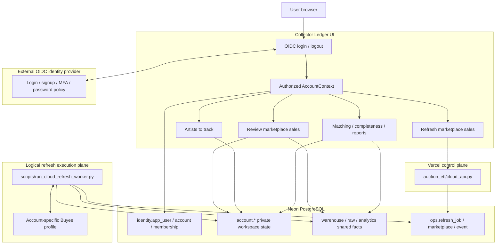
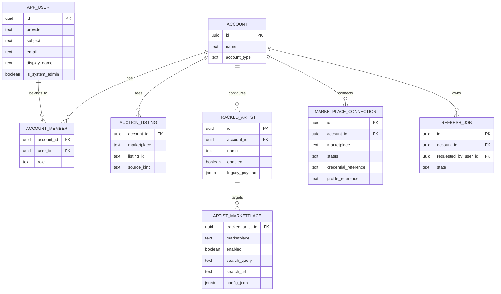
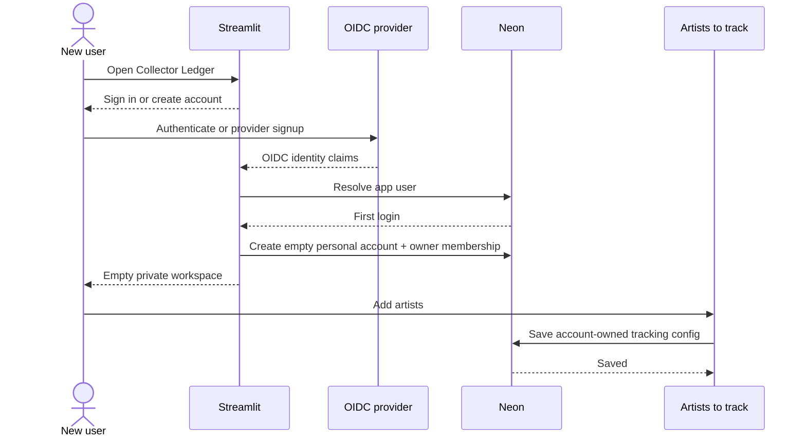
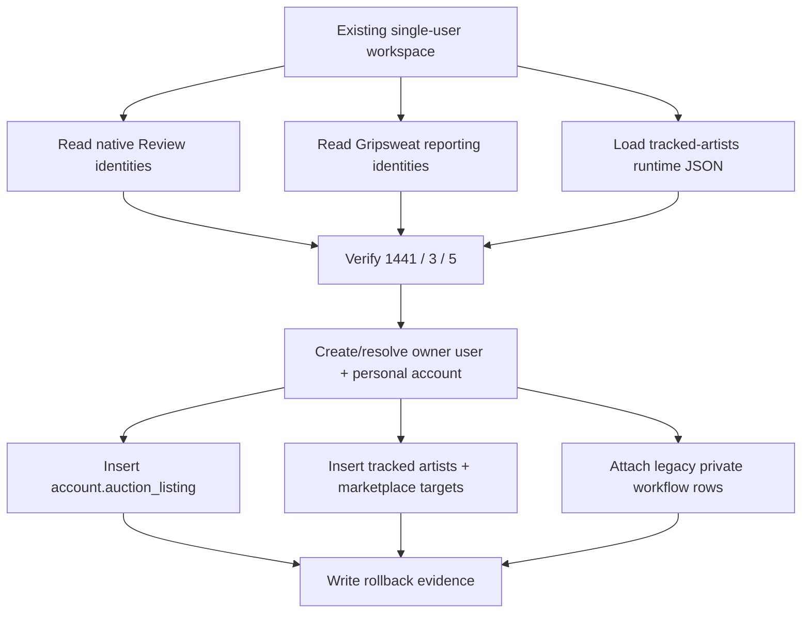
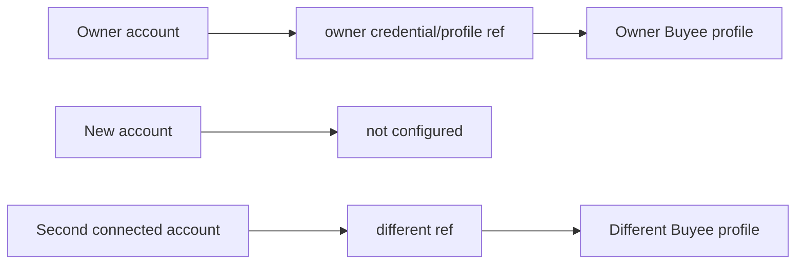

# Phase D — Authentication and Account-Tenancy Architecture

## 1. Status and boundary

Phase D is the authentication, authorization, and multi-user data-isolation
overhaul for Collector Ledger.

It is deliberately separate from the closed Vercel + Neon staging acceptance.
The prior Controlled-V3 evidence remains historical evidence and is not
reinterpreted as proof of authentication.

## 2. Required product behavior

### Existing owner

The current single-user workspace becomes the owner's personal account.

The migration must preserve these observed product counts before it is allowed
to mutate account state:

```text
Review marketplace sales:     1441 visible listings
Artists to track:             3 artists
Marketplace searches:         5 enabled artist searches
```

### New user

First successful login creates a personal workspace with:

```text
visible listings:          0
tracked artists:           0
collector decisions:       0
refresh history:           0
Buyee status:              not configured
```

No existing owner data is inherited.

## 3. Complete Phase-D topology



## 4. Authentication versus authorization

OIDC authentication answers:

> Who is this person?

Collector Ledger authorization answers:

> Which account may this person access, and which rows/actions belong to that
> account?

The immutable external identity is:

```text
(provider, OIDC subject)
```

Email and display name are profile metadata, not primary authorization keys.

## 5. Identity and tenancy model



## 6. Shared facts and private visibility

Canonical/source-derived marketplace facts should not be duplicated once per
account.

Examples of shared facts include:

```text
warehouse.auction
raw marketplace observations
source-derived normalized attributes
shared pressing/reference definitions
exchange/reference facts
```

Shared storage does not imply global user visibility.

The account visibility boundary is:

```text
account.auction_listing(
    account_id,
    marketplace,
    listing_id
)
```

Two accounts may point at the same listing identity while maintaining different
private curation.

## 7. Why the visibility bridge is not initially an FK to warehouse.auction

The Review page currently loads:

1. the best native warehouse review relation;
2. Gripsweat-only records from the reporting integration.

Therefore the current product-visible universe is wider than a simplistic
`warehouse.auction` FK assumption.

Phase D uses the stable unified identity:

```text
(marketplace, listing_id)
```

A later shared listing-registry refactor can create a stricter canonical FK
without blocking account isolation.

## 8. Account-owned state

The following are private to an account:

```text
listing visibility
collector values / notes / verdicts
collection status
manual pressing decisions
tracked artists
marketplace search configuration
refresh ownership/history
new-listing matching workflow
listing-completeness workflow
saved filters/preferences
marketplace connection state
Buyee profile/session references
```

## 9. New-user onboarding



The empty state is a security property, not missing migration data.

## 10. Existing-owner backfill



The backfill aborts on a count mismatch.

It never deletes canonical marketplace facts.

## 11. Artists-to-track overhaul

The current runtime JSON becomes a one-time migration source, not the
multi-user product authority.

New authority:

```text
account.tracked_artist
account.artist_marketplace
```

Each account can independently track different artists and marketplaces.

Search generation semantics remain reusable; only ownership/persistence changes.

## 12. Buyee isolation

Buyee is special because it relies on authenticated browser/watchlist state.



Never share between accounts:

```text
password
cookies
localStorage
browser profile directory
session tokens
watchlist authentication state
```

The database may store only opaque protected-storage references plus
non-secret status metadata.

A user may use eBay/Gripsweat without configuring Buyee.

## 13. Review marketplace sales

The current global read pattern must become:

```text
shared unified review surface
  FILTER/EXISTS account.auction_listing for current account
  JOIN account-owned collector values
```

The 1,441 count then means:

> listings visible to this authenticated account

rather than:

> every row in the shared review universe.

## 14. Durable refresh ownership

Every refresh job becomes account-owned:

```text
ops.refresh_job.account_id
ops.refresh_job.requested_by_user_id
```

All status operations must verify ownership.

A caller who knows another account's UUID job ID must still receive no
cross-account job data.

Physical worker concurrency and logical job ownership are separate concerns.
A worker may serialize expensive work globally while jobs remain independently
owned.

## 15. Vercel control-plane security

Streamlit's OIDC session does not automatically authorize a separate Vercel
endpoint.

The browser must never be trusted to choose `account_id`.

Recommended internal flow:

```text
Authenticated Streamlit server
  -> resolves account membership
  -> signs internal request containing account_id + user_id
  -> Vercel verifies server signature
  -> Vercel verifies membership/ownership
  -> Vercel reads/writes only account-owned refresh state
```

The existing refresh signing concept should be extended rather than replaced
with a browser-trusted account parameter.

## 16. Role model

Account membership roles:

```text
owner
admin
member
```

Global system administration is independent:

```text
identity.app_user.is_system_admin
```

Owning a personal account does not grant permission to mutate global shared
reference data.

Advanced/global tools must be hidden from ordinary users and protected
server-side.

## 17. PostgreSQL RLS defense in depth

The final D3 state should establish transaction-local context:

```text
collector_ledger.account_id
collector_ledger.user_id
```

Example policy shape:

```sql
USING (
    account_id = current_setting(
        'collector_ledger.account_id',
        true
    )::uuid
)
WITH CHECK (
    account_id = current_setting(
        'collector_ledger.account_id',
        true
    )::uuid
);
```

RLS is not enabled by D1. Enabling it before query conversion/backfill could
lock out the current application or create mixed tenant behavior.

## 18. Migration stages

### D0 — audit

No database mutation.

Generate:

```text
docs/ACCOUNT_SCOPING_MATRIX.generated.md
docs/ACCOUNT_SCOPING_MATRIX.generated.json
```

### D1 — additive schema

Create identity/account tables and nullable ownership columns.

Do not remove legacy uniqueness constraints yet.

Do not enable public login/signup yet.

### D2 — owner backfill and source conversion

- prove 1441 / 3 / 5;
- attach existing private rows to owner;
- account-scope Review reads and collector writes;
- move Artists-to-track persistence;
- account-scope refresh create/read/latest;
- account-scope matching/completeness;
- make navigation role-aware;
- isolate Buyee per account.

### D3 — enforcement

After all D2 tests pass:

- replace account-sensitive unique constraints;
- make required ownership columns non-null;
- change refresh-active uniqueness as designed;
- enable/force RLS;
- run cross-account negative tests.

### D4 — public authentication/onboarding

Enable login/logout and first-login personal-account bootstrap for real users.

## 19. Production and historical boundaries

Phase D must not:

- rerun Controlled V3;
- mutate historical acceptance evidence;
- require Railway;
- silently promote staging source/data;
- combine identity rollout with unrelated production promotion.

## 20. Acceptance criteria

Owner:

```text
OWNER_VISIBLE_LISTINGS=1441
OWNER_TRACKED_ARTISTS=3
OWNER_MARKETPLACE_SEARCHES=5
```

New user:

```text
NEW_ACCOUNT_VISIBLE_LISTINGS=0
NEW_ACCOUNT_TRACKED_ARTISTS=0
NEW_ACCOUNT_BUYEE_STATUS=not_configured
```

Isolation:

```text
CROSS_ACCOUNT_LISTING_READ=false
CROSS_ACCOUNT_COLLECTOR_WRITE=false
CROSS_ACCOUNT_REFRESH_READ=false
CROSS_ACCOUNT_REFRESH_WRITE=false
CROSS_ACCOUNT_BUYEE_PROFILE_ACCESS=false
```

Shared-fact safety:

```text
CANONICAL_MARKETPLACE_FACT_DUPLICATION=false
CANONICAL_AUCTION_ROWS_DELETED_BY_BACKFILL=false
```

Historical safety:

```text
CONTROLLED_V3_RERUN=false
RAILWAY_REQUIRED=false
```
